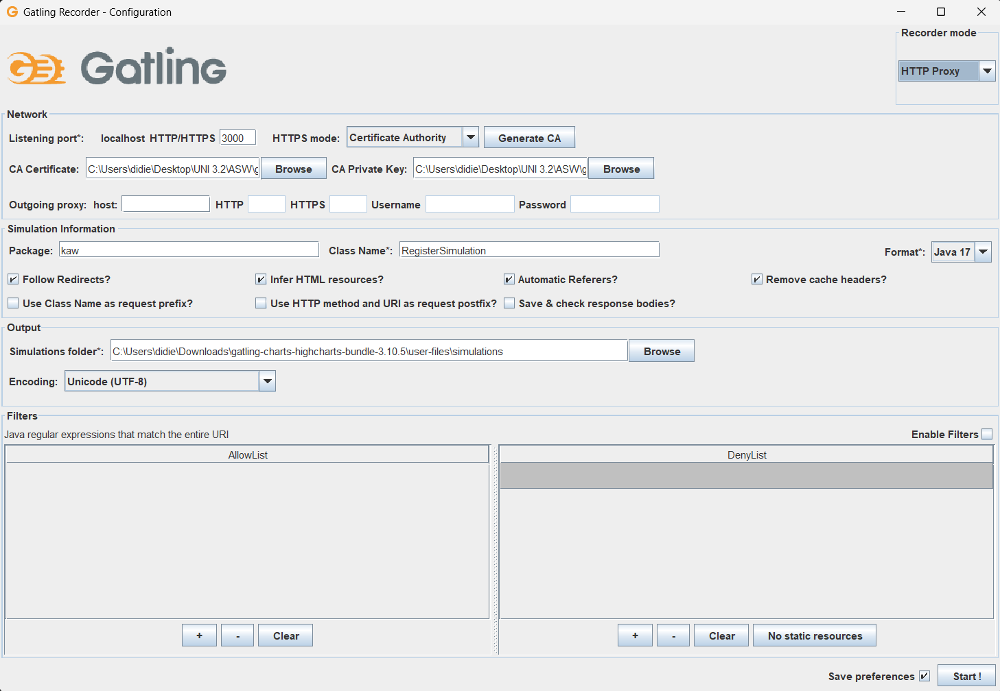
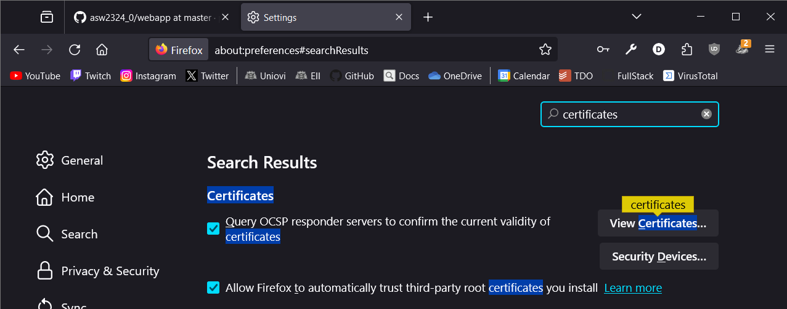
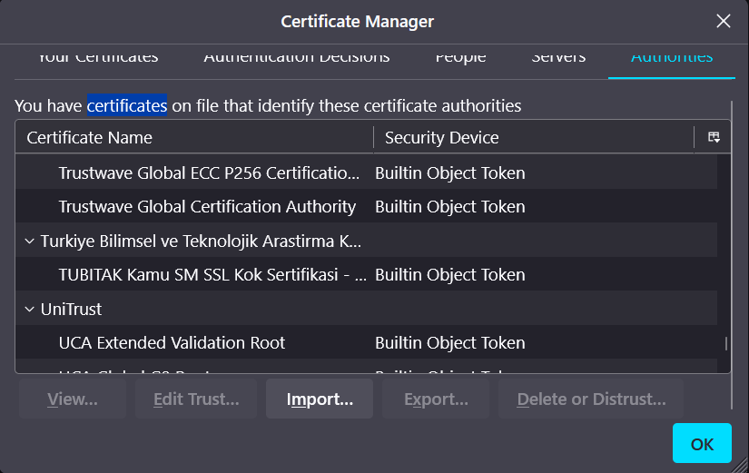
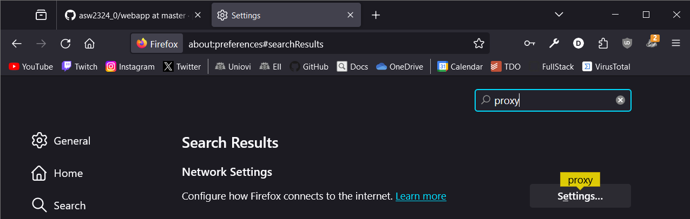
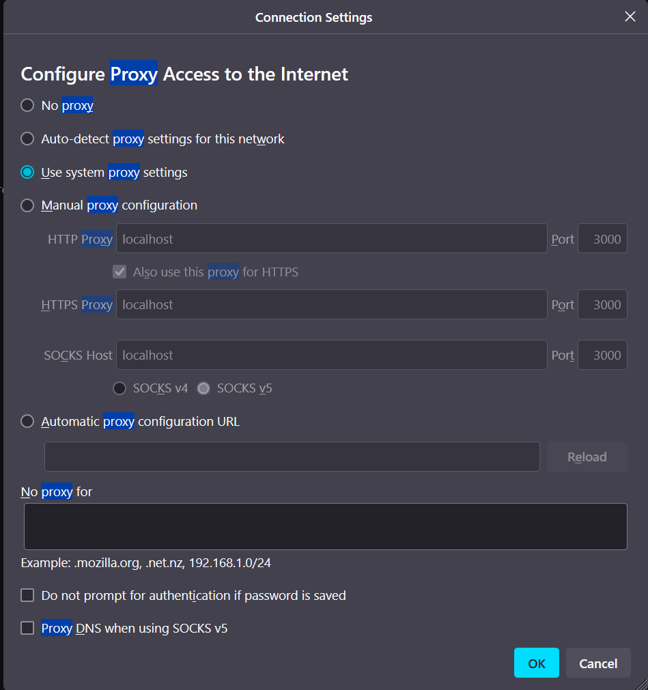
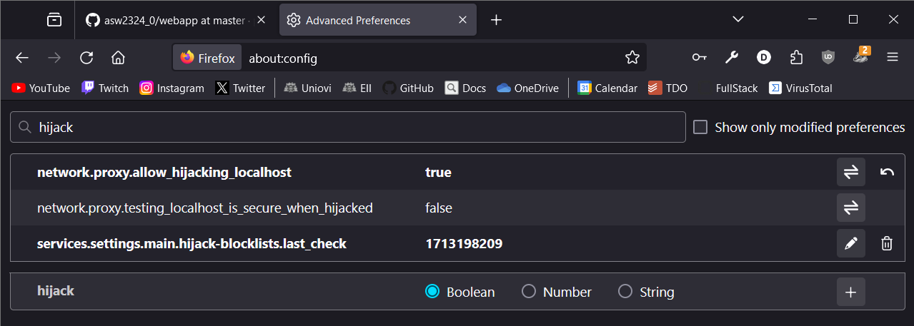
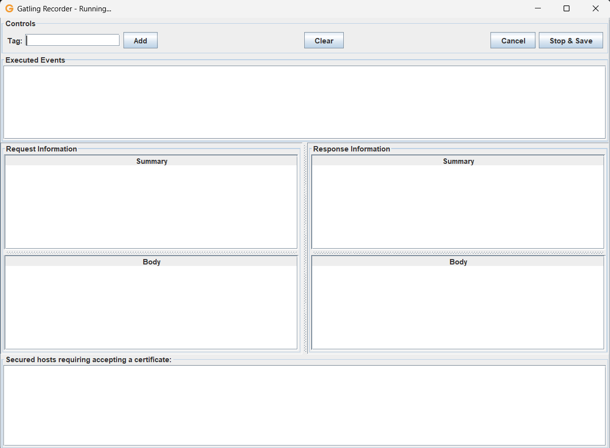

# How to Load Testing with Gatling!

## Now, running is even easier!! 🚀🚀

The LoadTesting folder has been refatored and now is a complete Java
Project.

- To run Recorder: Simply run the src/test/java/Recorder.java
- To run the Load Tests: Simply run the src/test/java/Engine.java and then select the
test you want.

If you want to change something from the Simulation classes, go to
src/test/java/kaw and there you will find well refactored Java classes for
better understanding.

Other Java classes:

- src/test/java/mongo/MongoHandler: This class helps the Simulation classes
to have some data stored in DB (ex. having 100 random users)
- src/test/java/util/LoadTestUtil: Simply to refactor some common test access.

## Understanding
1. First go to https://docs.gatling.io/reference/install/oss/ and download Gatling
   files. You will probably obtain a zip file. Uncompress it.
2. The main thing to understand about Gatling are its two parts:
   - Recorder: Java GUI Application that "helps" to build our tests (probably, you will
    have to go into the Java code generated to solve errors).
   - Gatling runner: A simple application to run our tests.
   These two applications can be found on the */bin* folder of the previously downloaded
   file. You may find .bat files (Windows) and .sh files (Linux and MacOS)

## Setting up the Recorder
To build our load tests we have to set up our proxy Recorder. For that, first we run our
Recorder file with:
``
.\bin\recorder.bat
``
This will display an interface like this

The things we have to configure are:
- Recorder mode: Put it to *HTTP Proxy*.
- Listening port: This will be where our Proxy (Recorder) will be located. We can assign it whichever
                  we want but except the port our App is located at (right now, it is on port 80).
                  Assign it port 3000
- HTTPS mode: We have to select *Certificate Authority* and later press *Generate CA*. This will
              generate two pem files (certificate and key). Store them in a locatable place.
              If it is not automatically, assign the generated files to CA Certificate and CA Private
              Key respectively.
- Package: This is the name of the Java package that will hold our tests.
- Class name: The name of the Java class (or Scala,Kotlin,...) of our test to record.
- Format: You *must have a JDK installed!!*. For this case, Java 17 is used.

Finally, Mark the checkboxes seen in the image if they are not already and leave the rest of the
options as they are.

## Setting up our browser

If we are going to use the Recorder, we need to change some settings from our browser
since we have to use it as a Proxy. For this example we will use *Firefox*. If you do
not have it, please install it or check for similar settings in your favorite browser.

- Certificate: We must make Firefox to accept our CA certificate. For that, type in the
               browser searching box *about:preferences*. Then, type *certificates*
               
               Enter into *View Certificates > Authorities > Import*
               
               Select the CA certificate generated previously and you must see *GatlingCA*
               in the list of approved CAs.
- Proxy: Now, we must tell the browser to use the proxy port (the one you assigned) of the
         Recorder. In the same page, search for *proxy*.
        
        Set the Proxy to *Manual proxy configuration* and then assign all the fields
        (HTTP(S) Proxy and SOCKS) to *localhost* at the port you assigned to the Recorder.
        
        Careful! Once the proxy is set all HTTP or HTTPS connections will be redirected to
        the Recorder if active. If it is not, you won't be able to browse unless you reset
        the proxy configuration to *Use system proxy settings* or whichever configuration
        you had.
- Localhost Hijack (*valid for Firefox*): In the browser searching box, type *about:config*
                                          and once there type *hijack*. Finally, set the field
                                          *network.proxy.allow_hijacking_localhost* to *TRUE*.
                                          
                                          This option is simply to also use our Proxy in localhost
                                          domain.

## The Recording

Once the Recorder is set and the Browser has been configured correctly, you can star to Record. So
you can press on *Start* on the Gatling Interface. This will pop-up another window where all your actions
performed in the browser are beign kept.

If you misclicked something or want to start again, simply press the button *Clear* and all the previously
recorded actions will be deleted.

Once you finish, press in *Stop and Save*.

## Running the test

Now, you probably have a new Java class created with the name you gave it to in the Recorder. You
can find this class on */user-files/simulations/package-name/class-name.java*. The implementation
of a load test is pretty simple and can be understood by reading the code.

If compilation fails when running the test is because the Recorded did not perform well at assigning
variables. For example, I had many problems with the usage of *uri1* which was not defined. You will
have to assign a variable for it like:

``
private String uri1 = "localhost";
``

Other interesting thing from this file is at its constructor (which has no name - weird).
``
{
    setUp(scn.injectOpen(constantUsersPerSec(50).during(60).randomized())).protocols(httpProtocol);
}
``
Here you can change the number of users per second and the time the tests is going to be sending
these users. For the moment, you can merely play with these numbers to stress or not your application.
If you want other methods, please check in here: https://docs.gatling.io/reference/script/core/injection/

Other files generated by Recorder can be found at */user-files/resources/classsimulation/*. These folders
contain data used by the Simulation class to perform the different queries to the web page. For
example, when sending JSON through the body of an HTTP Request.

Finally, the important thing, To run a test simply run the Gatling application:
``
.\bin\gatling.bat
``
After that you will be prompted a menu, just type *1*. Then, all the simulation classes encountered
will be display, select the load test you want to run and let Gatling do the magic.

Once the test has finished, you will be displayed an HTML file with the report. You can also find this
file at */results/simulationName-timestamp/index.html*.
        